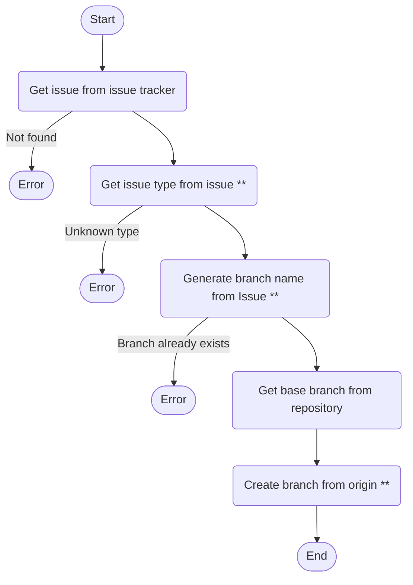
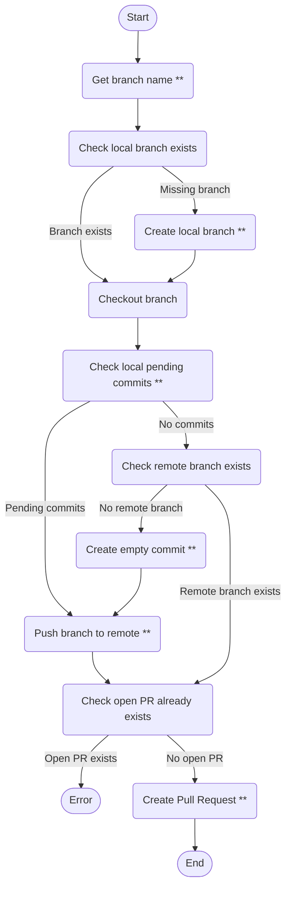
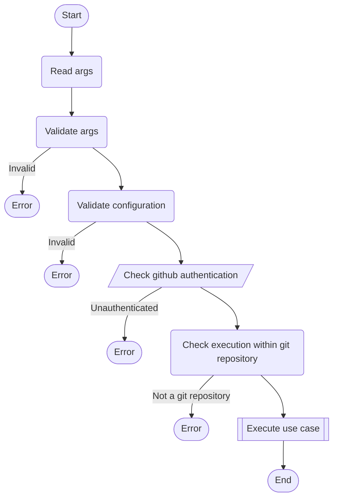

# Architecture

## Use case flows

### Create branch

Show/hide

*\*\* The user may need to enter input manually in interactive mode*

### Create pull request

Show/Hide

*\*\* The user may need to enter input manually in interactive mode*

## CLI flow

Show/hide

